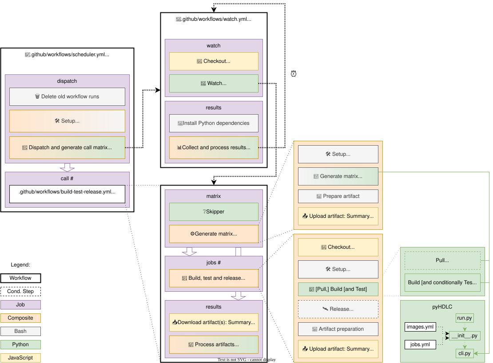

.. _Development:continuous-integration:

Continuous Integration (CI)
###########################

.. NOTE::
   At the moment, there is no triggering mechanism set up between different GitHub repositories.
   The CI is triggered by Push events, Pull Requests, CRON jobs, or manual dispatches (see
   :ref:`Structure <Development:continuous-integration:structure>`).

.. _Development:continuous-integration:status:

Status
======

.. include:: ../CIStatus.inc

.. _Development:continuous-integration:structure:

Structure
=========

The continuous integration in this repository is based on commands ``pull`` and ``build`` provided by the Python utils
(see :ref:`Development:utils:pyHDLC:Reference`); so, contributors can execute exactly the same commands locally, for
debugging and development.
However, there are several layers of complexity around those commands, in order to precisely decide which images to
build in each workflow/job execution.

  Structure of the Continuous Integration (CI) in this repository.

As shown in :numref:`img-ci`, the following wrappers are used:

.. TIP::
  * Since most of the complexity of the orchestration is defined in the YAML configuration files used by pyHDLC, reading
    :ref:`Development:configuration` is strongly recommended.
    Data from the configuration files is used in the reusable-dispatchable *build-test-release* workflow and in the
    build step of the composite action (see :numref:`img-ci`).

  * In :gh:`pyTooling/Actions: Context <pyTooling/Actions/#context>`, details about Action and Workflow kinds supported in
    GitHub Actions are explained.
    See also `Workflow syntax for GitHub Actions <https://docs.github.com/en/actions/using-workflows/workflow-syntax-for-github-actions>`__.

* :ghsrc:`scheduler <.github/workflows/scheduler.yml>` is a Dispatchable Workflow which reacts to Push events,
  Pull Requests, scheduled (CRON) runs and manual dispatches.
  It is the entry point of the CI: it decides which tasks to run, and launches the *watch* run which supervises them.

  * :ghsrc:`dag.setup.sh <.github/dag.setup.sh>` installs the dependencies of the scheduler script
    (``networkx`` and ``pygraphviz``).

  * :ghsrc:`dispatch.py <.github/dispatch.py>` parses the DAG of tasks defined in :ghsrc:`needs.dot <.github/needs.dot>`
    (see :numref:`img-needs`), validates that it is acyclic, and selects a subgraph from the triggering task list
    (which supports the ``F>``, ``>T`` and ``F>T`` window syntax, as well as the ``task:T`` and ``task:R`` suffixes
    for skipping tests and releases).
    Then, it computes the list of tasks to be executed through ``workflow_call`` (those with no pending predecessors)
    and launches a ``watch.yml`` run with the state of the whole graph.

* :ghsrc:`watch <.github/workflows/watch.yml>` is a Dispatchable Workflow which supervises the scheduled runs:

  * :ghsrc:`watch.py <.github/watch.py>` dispatches each task as soon as all its predecessors have completed, watches
    the running workflows, reruns failed ones up to the configured ``rerun`` attempts, and cascades cancellations to
    their descendants.

  * :ghsrc:`results.py <.github/results.py>` runs when the watch finishes and:

    * if the watch run exceeded the maximum execution time, dispatches a new ``watch.yml`` run with the same schedule
      (time resurrection);
    * if the watch run was cancelled for any other reason, cascades the cancellation to the runs in progress;
    * in any case, gathers the conclusions of all scheduled runs and prints a summary of the scheduling.

.. graphviz:: ../../.github/needs.dot
   :name: img-needs
   :align: center
   :caption: Workflow scheduling

* *build-test-release* is both:

  * a local Composite Action :ghsrc:`build-test-release/action.yml <.github/build-test-release/action.yml>` with six
    steps, including setting up, pulling/building/testing, releasing and uploading the summary artifacts.

  * a local Reusable and Dispatchable Workflow
    :ghsrc:`workflows/build-test-release.yml <.github/workflows/build-test-release.yml>` with three jobs.
    The ``scheduler`` calls it once per initial task, the ``watch`` dispatches it for each of the remaining ones, and it
    can also be triggered manually.

    * The first job, named *matrix*, uses the Composite Action :ghsrc:`generate-matrix/action.yml <.github/generate-matrix/action.yml>`,
      which runs ``pyHDLC jobs`` and generates the list of images to be built (see `docs.github.com: Workflow syntax for GitHub Actions » jobs.<job_id>.outputs
      <https://docs.github.com/en/actions/using-workflows/workflow-syntax-for-github-actions#jobsjob_idoutputs>`__).
    * The second job, named *jobs*, runs the *build-test-release* Composite Action in parallel for each of those images.
    * The third job, named *results*, downloads the summary artifacts of the previous job and renders the overall
      report with :ghsrc:`summary.py <.github/summary.py>`.

.. IMPORTANT::
  :ghsrc:`formal <.github/workflows/formal.yml>` and :ghsrc:`impl <.github/workflows/impl.yml>` are standalone
  Dispatchable Workflows, kept apart because the Reusable and Dispatchable Workflow cannot yet express their *pull* lists.
