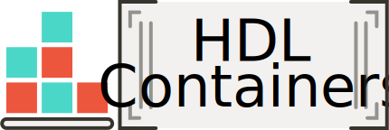

HDL Containers
##############

.. |SHIELD:WorkflowTest| image:: https://img.shields.io/github/workflow/status/dbhi/qus/Test?longCache=true&style=flat-square&logo=github&label=Test
   :alt: 'Test' workflow Status
   :height: 22
   :target: https://github.com/hdl/containers

.. raw:: html

     

This repository contains scripts and GitHub Actions (GHA) YAML workflows for building, testing and deploying https://opencontainers.org/[OCI] images (aka https://www.docker.com/[Docker] | https://podman.io[Podman] images) including open source https://en.wikipedia.org/wiki/Electronic_design_automation[electronic design automation (EDA)] tooling.
All of them are pushed to http://gcr.io/hdl-containers/[gcr.io/hdl-containers], and mirrored to https://github.com/orgs/hdl/packages[ghcr.io/hdl] and https://hub.docker.com/u/hdlc[hub.docker.com/u/hdlc]:

.. |SHIELD:WorkflowTest| image:: https://img.shields.io/badge/-gcr.io/hdl--containers-555555.svg?longCache=true&style=flat-square&logo=OpenContainersInitiative&logoColor=f2f1ef
   :alt: 'Google Container Registry'
   :height: 22
   :target: https://gcr.io/hdl-containers

.. |SHIELD:WorkflowTest| image:: https://img.shields.io/badge/-ghcr.io/hdl-555555.svg?longCache=true&style=flat-square&logo=OpenContainersInitiative&logoColor=f2f1ef
   :alt: 'GitHub Container Registry'
   :height: 22
   :target: https://github.com/hdl/containers/packages

.. |SHIELD:WorkflowTest| image:: https://img.shields.io/badge/-docker.io/hdlc-555555.svg?longCache=true&style=flat-square&logo=OpenContainersInitiative&logoColor=f2f1ef
   :alt: 'Docker Hub'
   :height: 22
   :target: https://hub.docker.com/u/hdlc

Find usage guidelines and how to contribute in the following sections:

- `User Guide <ug/index.html>`__
- `Development and contributing <dev/index.html>`__

.. note::
  Do you want to improve this page? `Edit it on GitHub <https://github.com/hdl/containers/edit/main/doc>`__

.. toctree::
  :hidden:

  CollectionsAndArchitectures
  ToolsAndImages
  ToDo
  Context
  References
